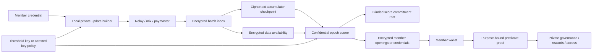

# Private trustgraphs Architecture

- **Status:** Research recommendation
- **Date:** 2026-08-12
- **Scope:** Private vouches, private scores, private membership, and coercion minimization
- **Supersedes:** [`research/archive/PRIVACY_ARCHITECTURE.md`](archive/PRIVACY_ARCHITECTURE.md)

## Executive decision

Trustgraphs should add a **separate private network profile**, not attempt to make the current public-EAS profile private with a configuration flag.

The recommended design is a **Private Epoch Rollup** with four independently replaceable layers:

1. **Anonymous admission and encrypted ingestion.** Members submit fixed-size, encrypted state updates through relayers. A public accumulator commits to every admitted ciphertext batch without exposing voucher, target, weight, comment, or member address.
2. **Confidential epoch computation.** A confidential scorer consumes exactly the checkpointed inputs, maintains the hidden graph, runs a fixed-schedule scoring program, and commits to blinded score records. A TEE-backed implementation is the practical pilot; an actively secure MPC committee is the stronger target.
3. **Private score presentation.** The public output is only a commitment root and minimal epoch metadata. Members receive private openings or anonymous credentials and prove policy predicates such as `score >= threshold` without disclosing identity or exact score.
4. **Privacy-compatible consumers.** Governance and rewards must consume anonymous score proofs. The current voting, distribution, and signer-sync contracts re-publish identity or score and therefore cannot be attached unchanged.

Interfold is worth prototyping for two bounded roles: private aggregate governance and the CRISP vote-masking pattern for receipt ambiguity. Its current E3 protocol is a one-shot private-input/public-output computation, not a drop-in persistent private graph or private-score service. Trustgraphs should not make the current Interfold network its sole production confidentiality boundary.

Commonware is also worth a focused prototype. It is a strong candidate for the active-MPC committee's networking, consensus, encrypted log, storage, DKG/resharing, and result-certification substrate. Its current libraries should not be mistaken for a general-purpose MPC engine: trustgraphs would still need an actively secure secret-shared PageRank implementation and a separate private-output protocol.

The minimum credible product claim is:

> The public chain, indexers, and data-availability layer receive neither vouch plaintext nor stable endpoint identifiers. Under the stated relay, batching, and key assumptions, an ordinary observer cannot link an admitted update to both its voucher and target. The public score commitment does not expose a member's identity or score.

Stronger claims require stronger deployments:

- A TEE pilot still trusts the confidential-compute hardware, its supply chain, attestation service, and operational controls.
- An MPC deployment can hide the graph from any coalition smaller than its declared corruption threshold.
- Neither deployment makes vouching fully coercion-proof. The protocol can make receipts ambiguous and allow replacement or withdrawal, but a supervised device, compromised endpoint, threshold collusion, or voluntary disclosure can defeat privacy.

## Why privacy changes the architecture

The current pipeline intentionally makes the graph and result available:

```text
public EAS attestation
  -> public resolver event
  -> public accumulator of (attester, recipient, UID, time, data hash)
  -> SP1 host reconstructs every plaintext edge
  -> SP1 guest computes all scores
  -> public Merkle root + public plaintext score CID
  -> contracts reveal identity, score, vote, or payment on use
```

This gives trustgraphs a valuable integrity property: the SP1 journal is bound to the exact accumulator checkpoint, so a prover cannot silently omit an unfavorable edge. It does not give confidentiality. SP1 hides a witness from the onchain verifier; it does not hide the witness from the host or proving service that receives it.

The archived privacy proposal was written for the removed WAVS/Commonware operator topology. Its threat analysis remains useful, especially the observation that global PageRank requires some confidential domain to see or jointly process the graph. Its recommended WAVS operator substrate and integration plan no longer match the permissionless SP1 architecture. This report therefore preserves the current checkpoint/completeness invariant while replacing both the input and output formats. The later Commonware assessment is a fresh evaluation of the current library as a bounded MPC committee substrate, not a restoration of the old WAVS design.

## Required guarantees and explicit non-guarantees

Privacy is not one Boolean property. Product and protocol documentation should state which cells in this matrix are protected.

| Data or property | Public observer / indexer | Another member or target | One compute operator | Sub-threshold committee | Threshold collusion or compromised endpoint |
|---|---:|---:|---:|---:|---:|
| Voucher identity and target | Hide | Hide | TEE: sees; MPC: hides | Hide in MPC | Not guaranteed |
| Voucher value and status | Hide | Hide | TEE: sees; MPC: hides | Hide in MPC | Not guaranteed |
| Exact score | Hide | Hide by default | TEE: sees; MPC: shared | Hide in MPC | Not guaranteed |
| Membership-to-wallet link | Hide | Hide | May be avoidable | Hide if issuance is blind | Endpoint/issuer may disclose |
| Network size and activity | Pad/coarsen | Pad/coarsen | Sees or infers | Committee infers bounded metadata | Not guaranteed |
| Transferable proof of a vouch | Minimize | Minimize | Protocol-dependent | Protocol-dependent | Strong receipt-freeness not claimed |

### Mandatory first release

- Vouch topology, value, update/revocation state, and optional comment are unavailable to public observers and storage providers.
- The target does not receive a list of incoming vouchers. Otherwise retaliation and social pressure remain.
- Every admitted ciphertext in an epoch is bound to the computation checkpoint.
- An unauthorized party cannot inject or update a vouch as a member.
- No plaintext score list is published.
- Key loss, key rotation, state recovery, and historical-key compromise have designed responses.

### Desired stronger release

- No single compute operator can learn the graph or exact scores.
- Network membership is represented by unlinkable commitments or credentials rather than public EVM addresses.
- Score use reveals only an approved band or predicate, with a purpose-bound nullifier.
- Traffic analysis is reduced with batching, padding, relayers, and delayed release.

### Non-goals and caveats

- The system cannot protect a member whose device is monitored while they vouch.
- It cannot stop a member from revealing their own credential, plaintext, or randomness.
- A target may infer an edge from external knowledge or a score change. Delayed epochs, minimum cohort sizes, fixed score bands, and restrained output frequency reduce but do not eliminate this inference.
- Availability and censorship resistance do not follow from encryption. They require an available ciphertext log, inclusion receipts, and a forced-inclusion path.
- Hiding wallet identity does not solve Sybil resistance. Private admission still needs a governance and credential-issuance policy.

## Invariants carried forward

The private profile should preserve the strongest properties of the current design:

1. **Exact input binding.** A result is valid only for one explicit accumulator checkpoint, leaf count, policy hash, membership root, program key, epoch, and domain.
2. **Determinism.** Given the admitted updates and public policy, the hidden state transition and result root are deterministic.
3. **Replay separation.** Every proof, credential, ciphertext, and nullifier is scoped to chain, network instance, epoch, purpose, and program version.
4. **Replaceable scoring.** Privacy plumbing must not permanently select PageRank. Each scoring program has its own versioned input schema, output policy, and verification key or attested measurement.
5. **Public audit of protocol, private audit of records.** Observers can verify checkpoints, program versions, capacity bounds, and proof or attestation validity without learning the graph.

## Architecture



### 1. Private identities and admission

Each member should hold a network-specific identity secret and a blind-issued or privacy-preserving membership credential. Onchain state contains a commitment root for the current eligible set, not a public list of wallets. A registration proof should establish eligibility and uniqueness without linking subsequent vouches to the enrollment transaction.

Suitable building blocks include anonymous group membership proofs such as [Semaphore](https://docs.semaphore.pse.dev/), BBS selective-disclosure credentials in the [W3C VC Data Integrity BBS specification](https://www.w3.org/TR/vc-di-bbs/), [AnonCreds](https://hyperledger.github.io/anoncreds-spec/), and threshold credentials such as [Coconut](https://www.ndss-symposium.org/wp-content/uploads/2019/02/ndss2019_06A-1_Sonnino_paper.pdf). These solve presentation and admission, not graph computation.

Important design choices:

- **Private member identifier:** derive an epoch- or network-scoped commitment from a secret; do not use an EVM address as the graph node key.
- **Target selection:** the sender needs a way to resolve the intended recipient to a private network identifier. A public directory of identity commitments hides the wallet link only if issuance and lookup are unlinkable. An authenticated private directory or OPRF-based lookup may be necessary.
- **Rate limiting:** use credential counters or scoped nullifiers. A stable public nullifier per voucher-target pair would reveal update linkage, so pair uniqueness is better enforced inside the confidential state unless that leakage is deliberately accepted.
- **Seeds:** if trusted seeds are private, commit to the seed set and include it in confidential input. Public seed addresses in `params.json` are incompatible with that goal.
- **Revocation:** publish a versioned revocation accumulator or short-lived epoch credential. Do not make every use linkable to a long-lived revocation handle.

“Membership private” should mean the public cannot link a person or wallet to the network. Publishing a padded membership-root commitment is acceptable; publishing a stable address list is not. Even a root leaks changes and may leak size unless the set is padded.

### 2. Encrypted updates and complete input capture

A vouch should be modeled as replaceable hidden state rather than an immutable public endorsement:

```text
PrivateVouchUpdate {
  voucher_id       // hidden member commitment
  target_id        // hidden member commitment
  sequence         // monotonic inside private state
  value            // bounded score/weight
  active           // update or revoke
  optional_note    // preferably omitted from scoring state
  epoch/domain
}
```

The client encrypts a fixed-size encoding to the epoch compute key and proves, without revealing the fields, that:

- it holds a valid, unrevoked membership credential;
- the ciphertext encrypts a canonical, bounded update for this network and epoch;
- the target identifier is well formed and, if policy requires, represents an admitted member;
- the update respects an anonymous rate limit; and
- encryption and the public ciphertext commitment are consistent.

The public chain should receive **batch commitments and counts**, not attester/recipient EAS fields. Ciphertext batches remain available through Ethereum blobs/calldata or another durable data-availability service. Their contents can be public ciphertext; their plaintext cannot. The accumulator folds each batch root, count, and epoch domain, producing the same sort of append-only commitment that `AttestationAccumulator` provides today.

The sequencer or relay returns an inclusion receipt. A user whose ciphertext is withheld can resubmit through a forced encrypted inbox. That route should still support a relayer/paymaster; a direct wallet transaction is an explicit metadata-privacy downgrade.

At checkpoint, the computation is bound to:

```text
(network, chain, epoch, private-program-version,
 input-accumulator, input-count, encrypted-DA-root,
 membership-root, revocation-root, policy-hash,
 previous-private-state-commitment, capacity-class)
```

This design protects completeness only for **admitted** ciphertexts. The membership proof verifier, batch-validation rule, data availability, inclusion receipt, and forced-inclusion window together define admission.

#### Do not encrypt direct EAS records and stop there

EAS supports offchain and private-data patterns, but its own documentation treats them as storage/selective-disclosure techniques, not a private global computation protocol: [offchain data](https://docs.attest.org/docs/tutorials/storing-offchain-data), [privacy overview](https://docs.attest.org/docs/core--concepts/privacy), and [private-data attestations](https://docs.attest.org/docs/tutorials/private-data-attestations).

An offchain EAS signature may be retained as an inner authorization format if interoperability is valuable. It must not be the public envelope: a normal signature is a transferable receipt, and public attester/recipient metadata recreates the original problem.

Free-text comments should be removed from global scoring input. If the product retains them, encrypt them separately to an intended reader, make disclosure opt-in, and do not include them in the persistent graph state. Comments are high-risk personal data and are not needed by the current score algorithm.

### 3. Traffic and metadata privacy

Cryptography does not hide timing, gas payer, IP address, ciphertext count, or epoch activity. The private profile therefore needs:

- fixed-size messages and a small number of public capacity classes;
- relayers or a mix-style submission service, with paymasters so a member wallet is not the gas payer;
- batch posting at fixed intervals;
- batch and membership-set padding;
- delayed score release and minimum cohort rules; and
- optional cover or mask traffic when the threat warrants its cost.

Padding policy is part of the privacy claim and must be measurable. “Encrypted” without a metadata policy is not “private vouching.”

### 4. Confidential scoring

Global trustgraphs scoring depends on the whole graph. A zero-knowledge proof protects the witness from the verifier, not from the machine constructing the witness and proof. There are three credible compute paths.

#### Recommended pilot: hardened TEE scorer

Run a private fork of `pagerank-core` in an attested confidential VM or enclave. Release the epoch decryption key only to an approved, reproducible measurement after it has verified the checkpoint and encrypted state version. The scorer decrypts inside the confidential boundary, applies all updates, computes scores, emits only a commitment root and encrypted member packages, and immediately re-encrypts state under the next epoch policy.

Operational requirements are part of the security protocol:

- reproducible builds and published measurements;
- remote-attestation verification independent of the hosting operator;
- encrypted, rollback-protected state with monotonic epoch binding;
- threshold-controlled key release rather than one operator-held master key;
- two independently hosted scorers comparing the same result commitment where feasible;
- outbound-network restrictions and audited logging that contains no plaintext;
- per-epoch forward secrecy and documented backup/recovery; and
- no plaintext witness sent to an ordinary remote SP1 proving service.

[AWS Nitro Enclaves](https://docs.aws.amazon.com/enclaves/latest/user/) illustrates the attestation model, but TEE trust includes hardware, firmware, vendor PKI, cloud control plane, and side-channel defenses. Recent confidential-computing failures such as AMD's [CVE-2025-54510 bulletin](https://www.amd.com/en/resources/product-security/bulletin/amd-sb-3034.html) and the [Fabricked attack](https://fabricked-attack.github.io/) are reminders not to make one TEE the permanent trust root.

The pilot may generate an SP1 integrity proof *inside* the confidential domain if performance permits. That improves public correctness while preserving input confidentiality from a separate prover. It does not remove the TEE trust unless witness generation and proving are themselves distributed or otherwise confidential.

#### Recommended target: actively secure MPC

Secret-share inputs and persistent graph state across three or four operationally independent organizations. A custom fixed-point message-passing implementation computes the state transition and either a blinded score root or threshold credential shares. Select the corruption model explicitly:

- honest-majority active security can be efficient but assumes a majority of committee parties do not collude;
- dishonest-majority systems such as SPDZ tolerate stronger collusion assumptions at greater preprocessing and runtime cost;
- identifiable abort and public slashing improve accountability but do not guarantee liveness.

[MP-SPDZ](https://github.com/data61/MP-SPDZ) is useful for prototypes and benchmarks; its maintainers explicitly do not position it as production software for security-critical applications. Recent private-graph work shows that specialized protocols are improving: [RMS](https://eprint.iacr.org/2024/568) provides actively secure graph analysis including PageRank, [emGraph](https://eprint.iacr.org/2025/590.pdf) explores efficient multi-party graph computation in a semi-honest model, and [GraphAce](https://www.usenix.org/system/files/usenixsecurity25-yu-jiping.pdf) studies secure two-party graph analytics. None is a drop-in trustgraphs service; their ownership models, leakage, corruption assumptions, and benchmarks must be reproduced against trustgraphs' sparse update stream.

#### Conditional path: threshold FHE

Threshold FHE can let an untrusted compute provider evaluate encrypted values while a committee controls decryption. It is attractive for fixed, bounded arithmetic and public aggregate outputs. The current TrustAware PageRank is a difficult first workload:

- sparse topology and degree normalization are private;
- division, comparison, convergence tests, and sorting are expensive or unnatural;
- seed-distance BFS and trust decay require private graph traversal;
- persistent updates need key rotation, re-encryption, or key switching; and
- private per-member outputs need threshold re-encryption or credential issuance, not ordinary public decryption.

Libraries such as [OpenFHE](https://openfhe.org/) are appropriate for workload experiments. The [Microsoft SEAL documentation](https://github.com/microsoft/SEAL/blob/main/README.md) accurately summarizes the programming constraint: encrypted branching is not available in the ordinary way, and comparison/sorting are generally infeasible without redesign.

### 5. Make the scoring program privacy-friendly

The current Rust core is deterministic and fixed point, which is a good base. A private program should nevertheless change several behaviors:

- Run a public fixed number of iterations. Data-dependent early stopping leaks convergence and complicates MPC/FHE.
- Replace or isolate seed-distance BFS and `trust_decay`. Benchmark a fixed-depth propagation or polynomial weighting that has a regular execution schedule.
- Publish maximum graph capacity, update capacity, and outdegree bounds, then pad within a coarse class.
- Enforce last-write-wins and pair uniqueness inside confidential state.
- Use hidden node commitments or field elements throughout; do not convert them back to public addresses.
- Separate scoring from ranking. A public ordering of all members defeats score and membership privacy.

An algorithm-change decision deserves governance review because privacy-friendly scoring may not be numerically identical to the current public profile. Both profiles can coexist under different program/version identifiers.

### 6. Private score output

The current plaintext JSON/IPFS score blob and `keccak256(address, score)` leaves must not exist in the private profile.

The confidential scorer constructs a padded set of blinded records such as:

```text
leaf = Poseidon(
  network_domain,
  epoch,
  member_secret_commitment,
  score_or_band,
  policy_version,
  random_blinding
)
```

It publishes only the score root, padded capacity class, epoch, program identity, and state-transition proof or attestation. High-entropy identity commitments and per-record blinding prevent dictionary attacks on the root.

Each member privately receives one of:

1. an encrypted Merkle opening and exact score;
2. an encrypted opening for a coarse score band; or
3. shares of an anonymous credential issued by the compute committee.

The member then creates a local proof bound to `(verifier, network, epoch, purpose, challenge, expiry)` that establishes an approved statement:

- valid member for this epoch;
- score in one published band;
- score at least a fixed governance threshold; or
- eligibility for one fixed reward tier.

A scope-specific nullifier prevents double voting or double claiming without linking the same member across unrelated consumers. Consumers should offer a small, policy-defined set of thresholds. Arbitrary threshold queries let a verifier binary-search an exact score.

Private result delivery is an unsolved product detail, not an API footnote. Initial delivery can use a member-provided epoch encryption key and a padded encrypted package store. At larger scale, evaluate PIR or oblivious delivery. [SimplePIR](https://www.usenix.org/conference/usenixsecurity23/presentation/henzinger) is relevant to retrieval, but PIR does not solve graph computation, authorization, or access-pattern leakage by itself.

### 7. Privacy-compatible consumers

The existing consumers deliberately reveal data:

- `MerkleGovModule` stores the voter and emits vote choice and exact voting power.
- `MerkleFundDistributor` verifies and emits public account/value claims and pays a public address.
- Safe signer synchronization necessarily makes the owner set public.

The private profile needs different modules.

#### Governance

Use anonymous score-band credentials to authorize a private ballot. Only the aggregate result should be decrypted. Interfold/CRISP is a plausible experiment for small bounded tallies. MACI is another useful reference for coordinator-based anti-collusion and key-change behavior, but its own audited threat analysis notes that bribery can remain when users disclose secrets; it is not a generic receipt-freeness theorem ([MACI](https://maci.pse.dev/), [2024 audit](https://maci.pse.dev/assets/files/20240223_PSE_Audit_audit_report-a181b98b05198c102be49113c354b5f2.pdf)).

Exact score-weighted voting creates a fingerprint. Prefer a few weight bands, cap weight, aggregate ballots before release, and suppress tiny cohorts. If an exact total is required, state the inference risk.

#### Rewards

Use a shielded claim note or anonymous tier credential, a purpose nullifier, and a shielded or stealth payout path. A public transfer to a member wallet with the exact score-derived amount immediately reveals membership and often the score. Fixed/coarse tiers and delayed batched withdrawals reduce fingerprinting.

#### Signer sync and public roles

Some roles are inherently public. A Safe owner or onchain administrator cannot be privately synchronized into a public owner list. Treat these as explicit opt-in public roles rather than weakening the network-wide privacy claim silently.

## Coercion and receipt resistance

Encryption prevents an observer from reading a vouch; it does not prevent the sender from proving what they encrypted. A public signature, ciphertext plus encryption randomness, or deterministic acknowledgment can become a bribery receipt. Formal voting literature distinguishes ballot secrecy from receipt-freeness and coercion resistance; see Ryan and Schneider's [coercion-resistance analysis](https://markryan.eu/research/papers/pdf/06-csfw.pdf).

Trustgraphs should describe the goal as **coercion minimization and receipt ambiguity** until a formal protocol and audit support a stronger claim.

Recommended mechanisms are cumulative:

1. **Replaceability and revocation.** A vouch is mutable hidden state. A member can update or withdraw it after leaving a coercive setting.
2. **No public final-state acknowledgment.** Public events must not identify the member, target, value, or whether a ciphertext was a real update or cover message.
3. **Relayed submission.** Do not bind the update to the member's wallet transaction.
4. **Delayed, batched results.** Avoid an immediate score delta that confirms a particular vouch.
5. **Indistinguishable masking.** Let authorized or public maskers submit a ciphertext that rerandomizes an opaque slot without changing its plaintext effect. The proof must hide whether the message was a real update or a mask.
6. **No final-block privilege.** Accept a mask/finalization period after the update deadline so a coercer cannot demand the last observable message.
7. **Coarse outputs and cohort rules.** Reduce inference from individual score movement.

Interfold's CRISP example demonstrates an especially relevant mask: anyone can homomorphically add an encryption of zero to a ballot slot, changing the ciphertext without changing the plaintext. Its [receipt-freeness article](https://blog.theinterfold.com/vote-masking-receipt-freeness-secret-ballots/) explains the intended ambiguity, and the [CRISP circuit](https://github.com/theinterfold/interfold/blob/main/examples/CRISP/circuits/bin/crisp/src/main.nr) makes the mask/real branch private. Trustgraphs can adapt the idea to epoch update slots, but must solve masker incentives, public slot linkage, front-running, final-window timing, and persistent state.

Masking does not erase a previously published ciphertext or protect a coerced device. It makes proof of the **final effective state** less reliable. That is meaningful but narrower than full coercion resistance.

## Interfold assessment

### What it provides

Interfold's E3 architecture combines BFV fully homomorphic encryption, publicly verifiable distributed key generation and threshold decryption, client proofs of correct encryption, and an untrusted compute provider. An ephemeral committee creates a shared public key; users submit proven ciphertexts; the provider evaluates an allowed computation; committee shares decrypt and publicly verify the result. The official [introduction](https://docs.theinterfold.com/introduction), [cryptography overview](https://docs.theinterfold.com/cryptography), [architecture overview](https://docs.theinterfold.com/architecture-overview), and [computation flow](https://docs.theinterfold.com/computation-flow) document this lifecycle. GRECO describes the FHE/ZK bridge for valid encrypted inputs ([official article](https://blog.theinterfold.com/enclave-cryptography-greco-fhe-zk/)).

That is an excellent match for:

- a bounded, one-shot private ballot with a public aggregate;
- additive score or threshold experiments;
- studying publicly verifiable DKG and threshold decryption; and
- studying CRISP's ciphertext rerandomization/masking pattern.

### What trustgraphs would still need

The documented E3 lifecycle normally ends by publicly decrypting one result. Trustgraphs needs capabilities not currently exposed as a production path:

- a persistent encrypted graph across many epochs;
- state key rotation, key switching, or full re-encryption between ephemeral committees;
- private per-member score delivery or threshold credential issuance;
- hidden membership and anonymous admission;
- sparse private graph traversal, normalization, convergence, and ranking; and
- a defined recovery path if an epoch committee aborts after receiving updates.

Without those additions, trustgraphs would have to resubmit the full graph for every E3 or keep a long-lived E3/key, undermining the ephemeral model.

### Performance and maturity

Interfold's repository is active and released [v0.7.0 on 2026-08-10](https://github.com/theinterfold/interfold/releases/tag/v0.7.0), but the project describes Network Alpha as forthcoming rather than a production-open network in its [launch article](https://blog.theinterfold.com/fold-auction-uniswap/). The repository's [release-readiness issue](https://github.com/theinterfold/interfold/issues/1725) makes assurance work a no-go gate; public remediation includes [contract](https://github.com/theinterfold/interfold/pull/1727) and [circuit](https://github.com/theinterfold/interfold/pull/1703) work. The published [audit directory](https://github.com/theinterfold/interfold/blob/main/packages/interfold-contracts/audits/README.md) currently lists a token audit, not a complete assurance package for the full E3 stack. The documented Sepolia workflow uses mock proof verification, so it is appropriate for integration testing rather than evidence of production privacy or proof soundness ([operator documentation](https://docs.theinterfold.com/ciphernode-operators), [testnet tutorial](https://docs.theinterfold.com/tutorials/deploy-to-testnet)).

Repository benchmark reports are indicative rather than service-level commitments. Under the report's secure minimum parameters, the in-process Apple M4 Pro run records roughly 9.9 minutes for public-key generation and 12.4 minutes end to end; a nine-ciphernode micro configuration records roughly 87.5 and 93.4 minutes respectively, with multi-million-gas proof-verification steps ([minimum report](https://github.com/theinterfold/interfold/blob/main/circuits/benchmarks/results_secure_minimum/report.md), [micro report](https://github.com/theinterfold/interfold/blob/main/circuits/benchmarks/results_secure_micro/report.md)). PageRank would be materially more complex than the examples, so trustgraphs needs its own benchmark before drawing capacity conclusions.

Forward-secure per-E3 state remains an explicit design topic in [issue #1148](https://github.com/theinterfold/interfold/issues/1148). That is directly relevant because a later key compromise must not decrypt a permanent archive of historical vouches.

### Recommendation

Proceed with a bounded Interfold integration spike, not an architectural commitment:

- implement a score-band-weighted, private two-option tally;
- test CRISP-style zero masks and the finalization window;
- measure end-to-end latency, gas, ciphertext size, failure recovery, and committee abort;
- test whether a private credential proof can authorize the encrypted ballot without revealing membership; and
- document the exact public output and inference leakage.

Do not begin by expressing TrustAware PageRank as an Interfold program. First ask Interfold whether persistent encrypted state, threshold re-encryption/private output, key switching, and custom sparse FHE kernels are on a supported roadmap.

## Commonware assessment

### Why it is relevant

Commonware is a modular Rust library for specialized distributed systems. Its documented primitives include authenticated encrypted P2P communication, Byzantine consensus, broadcast and collection, durable storage, erasure coding, deterministic runtimes, invariant testing, and authenticated databases. Its cryptography crate includes BLS12-381 distributed key generation, proactive resharing, threshold signatures, timelock encryption, polynomial/secret-sharing foundations, and Bulletproof-style ZK circuits. The current library catalog and Rust API document these components ([Commonware library](https://commonware.xyz/), [`commonware-cryptography`](https://docs.rs/commonware-cryptography/latest/commonware_cryptography/)).

Those capabilities map well to the operational shell around an MPC scorer:

| Private trustgraphs need | Potential Commonware role |
|---|---|
| One canonical encrypted input history | BFT consensus over ciphertext-batch commitments and an append-only encrypted journal |
| Committee communication | Authenticated encrypted peer channels and message dissemination |
| Dynamic operator set | DKG bootstrap, proactive resharing, and epoch-bound committee reconfiguration |
| Input/state availability | Storage, coding, resolver, and synchronization primitives for encrypted data |
| Public epoch certificate | Threshold or attributable committee signature over the exact input checkpoint, program version, prior state, and blinded result root |
| Reproducible failure testing | Deterministic runtime, simulations, invariants, conformance checks, and deployment tooling |
| Admission-proof verification | Potential use of its ZK circuit/Bulletproof primitives, subject to a dedicated maturity and performance review |

This could remove a large amount of bespoke distributed-systems engineering from the MPC target. It does not require launching a new sovereign blockchain initially. A Commonware-based committee service can consume Ethereum-finalized private-inbox checkpoints and return a committee certificate or proof to an Ethereum snapshot contract.

### What it does not currently solve

No documented Commonware primitive is a general-purpose actively secure MPC engine. In particular, this review did not find a shipped equivalent of authenticated secret-shared arithmetic, Beaver-triple preprocessing, malicious-secure multiplication, oblivious graph access, secret comparisons, fixed-point PageRank, or threshold-issued private score credentials.

The distinctions matter:

- **DKG and threshold signatures are not MPC computation.** Commonware's BLS DKG produces shares of a signing secret. It does not secret-share the graph or execute arithmetic on graph shares.
- **A threshold certificate is not a correctness proof.** It proves that the required committee signed a result. If the signing threshold is corrupt, it can certify a false root. Active MPC or a separate validity proof must establish the state transition.
- **Resharing the signing key does not refresh graph state.** The private graph's shares need their own proactive refresh, authenticated storage, recovery, and committee-transfer protocol.
- **Timelock encryption is not private computation.** It releases plaintext after a threshold signature for a round becomes available. It does not evaluate PageRank while the graph remains encrypted.
- **Threshold decryption is not private output by default.** Reconstructing a ciphertext for the committee or public still reveals it. Trustgraphs needs decryption into a measured TEE, secret-shared reconstruction inside MPC, threshold re-encryption, or anonymous credential issuance.
- **ZK input proofs are not metadata privacy or receipt-freeness.** Relayers, padding, replacement, masking, and result-inference controls remain separate layers.

Commonware is actively researching batched threshold encryption. Its 2026 construction is especially relevant to efficient epoch ingestion, but the published setup requires secure multiplications in MPC and is presented with a Rust prototype rather than as an integrated production primitive ([BTE research](https://commonware.xyz/blogs/bte)). An open implementation item separately tracks on-demand batched threshold decryption ([issue #2182](https://github.com/commonwarexyz/monorepo/issues/2182)). This work could improve the encrypted inbox or conditional key-release layer; it does not replace the hidden graph computation.

### Recommended integration shape

```text
Ethereum PrivateInputAccumulator checkpoint
  -> Commonware committee orders and preserves encrypted batches
  -> active-MPC engine applies updates and computes hidden scores
  -> private-output layer creates blinded root and member packages
  -> Commonware committee certifies the epoch transcript/result
  -> Ethereum PrivateEpochSnapshot verifies certificate/proof
```

The MPC engine should initially sit behind a narrow adapter:

```text
transition(
  public_epoch_context,
  secret_shared_prior_state,
  secret_shared_admitted_updates
) -> (secret_shared_next_state, blinded_output_root, encrypted_outputs)
```

That boundary allows a prototype using MP-SPDZ or another research implementation, followed by a purpose-built Rust engine if benchmarks and review justify it. Commonware can coordinate sessions and preserve the canonical transcript without becoming part of the arithmetic protocol's security proof accidentally.

Use certificate modes deliberately. A compact threshold BLS certificate is useful for external verification, but it is non-attributable ([certificate documentation](https://docs.rs/commonware-cryptography/latest/commonware_cryptography/certificate/index.html)). During early deployments, attributable participant signatures and a consensus transcript may be preferable because they retain fault evidence. A final threshold certificate can be added after the failure and slashing model is defined.

### Maturity and recommendation

Commonware's February 2026 maturity statement classifies its BLS12-381 DKG/resharing, encrypted P2P, consensus, journal/archive storage, polynomial math, and several runtime components as **BETA**. In Commonware's terminology, BETA means stable wire/storage formats and long-term-support eligibility. The same statement says the library is not yet battle-tested and that no primitive had reached its DELTA, bug-bounty-eligible tier ([maturity statement](https://commonware.xyz/blogs/is-it-ready-yet)). Each selected primitive must therefore be pinned, stability-filtered, independently reviewed, and tested under trustgraphs' corruption and recovery model.

Proceed with a bounded four-node substrate spike:

1. Order fixed-size ciphertext batches and reproduce the same input checkpoint on every node.
2. Bootstrap BLS DKG, rotate one member with resharing, and verify the public key remains stable where intended.
3. Persist and recover the encrypted log after node loss without exposing plaintext or accepting rollback.
4. Call a dummy MPC adapter that returns a blinded result root, then produce both attributable votes and a threshold certificate over the full epoch domain.
5. Exercise equivocation, malformed batches, a silent node, a Byzantine dealer, stale state, committee rotation, and threshold loss in the deterministic runtime.
6. Measure message volume, finalization latency, recovery time, and operational complexity independently from the later PageRank benchmark.

Exit gate: Commonware demonstrably reduces committee engineering without weakening input completeness, creating a second canonical log, conflating signing shares with graph shares, or forcing trustgraphs to operate a separate blockchain.

## Options considered

| Option | Vouches hidden from public | Hidden from one compute party | Private score delivery | Persistent PageRank fit | Coercion story | Recommendation |
|---|---:|---:|---:|---:|---:|---|
| Encrypted/offchain EAS only | Yes, content only; metadata varies | No | No | Poor | Receipt remains | Inner envelope at most |
| ZK proof with private witness | Yes from verifier | No, prover sees witness | Possible with extra protocol | Integrity fit, not confidentiality | Public proof may be a receipt | Keep for binding/presentation |
| Single hardened TEE | Yes | No | Yes | Strong pilot fit | Needs separate mechanisms | Pilot |
| Replicated/threshold-key TEEs | Yes | Partially | Yes | Strong pilot fit | Needs separate mechanisms | Preferred pilot hardening |
| Active MPC committee | Yes | Yes below threshold | Yes | Plausible with custom implementation | Needs separate mechanisms | Target architecture |
| Threshold FHE / Interfold E3 | Yes | Yes below threshold | Not in standard public-output flow | Weak current fit | CRISP masking is promising | Bounded experiments |
| Local credentials only | No global edge computation | Yes | Excellent | Cannot reproduce global PageRank | Better local deniability | Alternative product model |
| PSI/PIR/ORAM | Specialized only | Specialized | Retrieval only | Not a scorer | None by itself | Components, not architecture |

### A simpler alternative worth preserving

If research shows that global confidential PageRank is too costly or fragile, change the product rather than make a false privacy claim. A local-first model could let vouchers issue unlinkable credentials directly to recipients, who prove accumulated thresholds or diverse-issuer predicates. BBS, AnonCreds, Coconut, or newer private promise/credential systems are relevant. This gives strong private presentation and removes the central graph processor, but it cannot reproduce global PageRank, transitive propagation, or graph-wide Sybil analysis. It is a different trustgraphs algorithm and product.

## Mapping to the current codebase

The private profile can reuse concepts, but should have new contracts and program identities.

| Current component | Privacy conflict | Private-profile change |
|---|---|---|
| `EASIndexerResolver` | Receives and emits public attester/recipient; only data is hashed in accumulator | Replace with fixed-size encrypted batch inbox and anonymous admission verifier |
| `AttestationAccumulator` | Fold includes public addresses, UID, time, and data hash | Add ciphertext-batch accumulator over batch root/count/domain/DA commitment |
| `AnchorRegistry` / lane 2 | Public node, activity, and envelope data; standard factory currently disables lane 2 | Reuse only the idea of an alternate input lane; define a new private schema/profile |
| `pagerank-core::RawEdge` | Contains address endpoints and raw EAS data | Add hidden field-element node IDs and `PrivateVouchUpdate`; fixed schedule |
| `reconcile` | Global LWW is correct but over public endpoints | Enforce LWW and uniqueness inside confidential state |
| `pagerank` | Data-dependent early stop and BFS trust decay | Fixed iteration count; benchmark a regular trust-decay replacement |
| SP1 host/guest | Host receives the full witness; guest emits all score records for public blob | Run inside confidential domain for pilot or replace state transition with MPC; new journal |
| `MerkleSnapshot` journal | Binds a public score CID/root and current program semantics | Add `PrivateEpochSnapshot` binding encrypted input checkpoint, prior state, blinded output root, capacity and privacy policy |
| Score JSON/IPFS | Plaintext account/value list | Publish no plaintext list; store padded per-member encrypted packages |
| `MerkleGovModule` | Public voter, choice, and exact voting power | Anonymous nullifier + private tally module |
| `MerkleFundDistributor` | Public account/value proof and transfer | Shielded tier claim and private payout route |
| Signer sync | Safe owner list is public | Exclude or require explicit public-role consent |
| Indexer/API | Materializes and serves all scores and events | Index only public epoch commitments, capacity classes, nullifiers, and aggregate outcomes |

The existing `MerkleSnapshot` proof journal cannot merely be relabeled. Its current guest output, score blob, leaf semantics, and downstream consumers define public behavior. A separate private program, verification key or attested measurement, snapshot contract, params validator, and factory profile make the privacy boundary auditable and prevent accidental connection to public consumers.

Because there is no production deployment yet, this is the least expensive time to choose private node identifiers and versioned private interfaces. The public profile can remain available for communities that deliberately value radical transparency.

## Key lifecycle and recovery

Historical vouches are unusually sensitive. A permanent public archive of epoch ciphertexts becomes plaintext if a long-lived key is later compromised. The design must use epoch keys and forward-security procedures:

- TEE profile: threshold release an epoch key to a measured program, transition persistent state, encrypt it under the next policy, and destroy the old plaintext/key; bind sealed state to a monotonic epoch to prevent rollback.
- MPC profile: proactively refresh secret shares and remove departed committee parties; define a threshold recovery set and a public resharing transcript that reveals no state.
- FHE profile: require supported key switching or threshold re-encryption before treating ephemeral committees as compatible with persistent state.
- Member outputs: use short-lived member encryption keys with a recovery/rotation protocol that does not make the public identity linkable.

Backups should contain only threshold-protected or sealed state. Disaster recovery must be rehearsed. “Delete the old key” is not credible if plaintext can appear in logs, swap, crash dumps, observability pipelines, or operator backups.

## Delivery roadmap

### Phase 0 — resolve product policy before cryptography

Decide and document:

- who may become a member and whether the issuer may know membership;
- whether a target must be an existing member;
- whether negative, zero, replacement, and revocation updates are allowed;
- whether the exact score is ever shown to the member;
- which consumers need a threshold, band, exact weight, or rank;
- acceptable public leakage for size, activity, cadence, and aggregate totals;
- the compute corruption threshold and candidate independent operators;
- whether comments are removed or recipient-encrypted outside scoring; and
- the concrete coercion adversary: remote briber, nearby observer, supervised device, or compromised endpoint.

Deliverable: a testable privacy specification using the guarantee matrix in this report.

### Phase 1 — local protocol and leakage prototype

Build an end-to-end local prototype with:

- identity commitments and mock blind membership issuance;
- fixed-size encrypted updates through a relay;
- a ciphertext batch accumulator and forced-inclusion simulation;
- a private fixed-schedule score computation;
- blinded score root and encrypted member packages;
- one `score >= threshold` proof with a purpose nullifier; and
- a leakage test that records every public event, size, time, and API response.

Exit gate: no public artifact contains voucher endpoints/value/comment, member-wallet link, exact score, or unblinded score leaf.

### Phase 2 — parallel compute spikes

Run the same bounded graph workload through:

1. two independent confidential-VM/TEE deployments with threshold key release;
2. an actively secure MPC prototype; and
3. an Interfold governance/CRISP experiment, not PageRank; and
4. a Commonware committee-substrate experiment around a dummy MPC adapter.

Measure update throughput, epoch latency, memory, communication, cost, abort recovery, state rotation, output delivery, and leakage. Red-team rollback, ciphertext omission, malformed inputs, direct-wallet linkage, committee dropout, and key compromise.

Exit gate: select the pilot compute profile based on evidence and publish its trust assumptions.

### Phase 3 — privacy-compatible consumer

Implement one narrow consumer, preferably anonymous score-band governance with a public aggregate. Do not connect the private root to the current governance or distributor contracts.

Exit gate: a user can enroll, vouch, replace/revoke, receive a private band, and vote without a public link across those actions; the tally remains auditable.

### Phase 4 — external review and limited deployment

- cryptographic protocol review, including statement soundness and domain separation;
- TEE/MPC implementation and operations audit;
- formal review of coercion claims and mask/update timing;
- metadata and application-layer privacy assessment;
- recovery and committee-rotation exercise; and
- limited community pilot with explicit informed-consent language.

Do not advertise “coercion resistant,” “anonymous,” or “no one can see the graph” more strongly than the audited deployment supports.

## Research questions that can change the recommendation

1. Can the user experience support anonymous membership keys, backup, recovery, and private target lookup without reverting to public wallets?
2. Is a private exact score genuinely necessary, or are a few policy bands sufficient? Bands are materially easier and safer to consume.
3. Can seed-distance trust decay be replaced with a fixed-schedule formulation without harming Sybil resistance?
4. What is the maximum graph/update capacity per epoch, and what padded capacity classes are affordable?
5. Which organizations could operate an MPC committee with meaningfully independent failure and legal domains?
6. Does the community prefer a TEE trust assumption now, or a slower launch after MPC matures?
7. How is censorship detected when an anonymous user wants an inclusion receipt without creating a transferable vouch receipt?
8. Can result packages be delivered without the fetch pattern linking a member to one leaf?
9. What score-change inference remains after bands, batching, delay, and minimum cohorts?
10. Which Interfold roadmap items have committed interfaces and audited implementations: persistent state, key switching, private output, committee recovery, and custom sparse compute?
11. Can Commonware handle the committee's canonical encrypted log, reconfiguration, recovery, and result certification without becoming a second consensus domain or obscuring the MPC protocol's separate trust assumptions?

## Bottom line

Private trustgraphs is feasible if the project treats privacy as a new protocol profile and narrows its claims carefully. The architecture should retain public input completeness while changing what is accumulated: commitments to anonymous encrypted updates rather than public EAS edges. It should retain verifiable scoring while changing who sees the witness: an attested confidential domain for the pilot and an active MPC committee as the stronger target. It should retain composability while changing the output: purpose-bound private predicates rather than a public address/score table.

Interfold contributes valuable FHE/ZK/DKG machinery and the most directly relevant receipt-ambiguity experiment found in this review. Today it is best treated as a component and research partner, especially for private aggregate governance, not as the sole persistent trustgraphs compute layer.

Commonware is a complementary candidate rather than an Interfold alternative: it can provide the durable, Byzantine committee substrate around active MPC, while the MPC engine provides graph confidentiality and computation. A bounded integration spike is warranted, but threshold cryptography and consensus must not be presented as though they already implement private PageRank.

Most importantly, encryption alone does not solve bribery or coercion. Replaceable vouches, relayed and padded traffic, delayed/coarse outputs, mask messages, private consumers, and honest language about endpoint compromise all belong in the definition of a healthy private trustgraph.

## Primary references

### Trustgraphs implementation

- [`src/contracts/eas/AttestationAccumulator.sol`](../src/contracts/eas/AttestationAccumulator.sol)
- [`src/contracts/eas/resolvers/EASIndexerResolver.sol`](../src/contracts/eas/resolvers/EASIndexerResolver.sol)
- [`src/contracts/merkle/MerkleSnapshot.sol`](../src/contracts/merkle/MerkleSnapshot.sol)
- [`packages/pagerank-core/src/compute.rs`](../packages/pagerank-core/src/compute.rs)
- [`packages/pagerank-core/src/pagerank.rs`](../packages/pagerank-core/src/pagerank.rs)
- [`src/contracts/zodiac/MerkleGovModule.sol`](../src/contracts/zodiac/MerkleGovModule.sol)
- [`src/contracts/merkle/MerkleFundDistributor.sol`](../src/contracts/merkle/MerkleFundDistributor.sol)
- [`research/OFFCHAIN_ATTESTATIONS_ZK.md`](OFFCHAIN_ATTESTATIONS_ZK.md)

### External systems and research

- [Interfold documentation](https://docs.theinterfold.com/introduction) and [source repository](https://github.com/theinterfold/interfold)
- [CRISP vote masking](https://blog.theinterfold.com/vote-masking-receipt-freeness-secret-ballots/)
- [Commonware library](https://commonware.xyz/), [`commonware-cryptography`](https://docs.rs/commonware-cryptography/latest/commonware_cryptography/), and [maturity model](https://commonware.xyz/blogs/is-it-ready-yet)
- [Commonware batched threshold-encryption research](https://commonware.xyz/blogs/bte)
- [Semaphore](https://docs.semaphore.pse.dev/)
- [W3C BBS cryptosuite](https://www.w3.org/TR/vc-di-bbs/)
- [AnonCreds specification](https://hyperledger.github.io/anoncreds-spec/)
- [Coconut threshold credentials](https://www.ndss-symposium.org/wp-content/uploads/2019/02/ndss2019_06A-1_Sonnino_paper.pdf)
- [MACI](https://maci.pse.dev/)
- [MP-SPDZ](https://github.com/data61/MP-SPDZ) and [SPDZ](https://eprint.iacr.org/2013/143.pdf)
- [RMS secure graph analysis](https://eprint.iacr.org/2024/568), [emGraph](https://eprint.iacr.org/2025/590.pdf), and [GraphAce](https://www.usenix.org/system/files/usenixsecurity25-yu-jiping.pdf)
- [OpenFHE](https://openfhe.org/) and [Microsoft SEAL](https://github.com/microsoft/SEAL)
- [AWS Nitro Enclaves](https://docs.aws.amazon.com/enclaves/latest/user/)
- [SimplePIR](https://www.usenix.org/conference/usenixsecurity23/presentation/henzinger)
- [EAS privacy guidance](https://docs.attest.org/docs/core--concepts/privacy)
